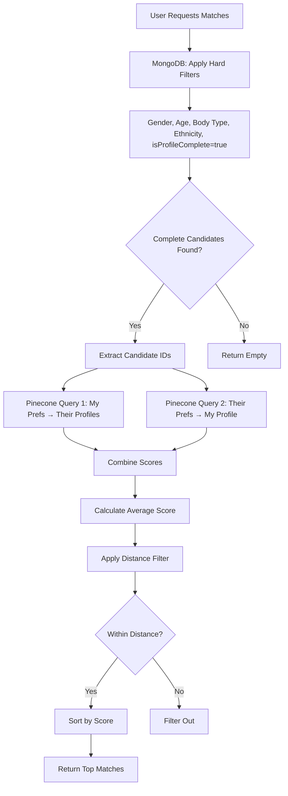

# AI-Powered Vector Matching Implementation

## Overview

This implementation enhances the existing matchmaking system with **AI-based similarity search** using:

- **HuggingFace Embeddings** (`BAAI/bge-large-en-v1.5`) - Converts user profiles to semantic vectors (1024 dimensions)
- **Pinecone Vector Database** - Stores and searches vectors for similarity matching (1024 dimensions)
- **MongoDB** - Remains the primary data store and source of truth

## Architecture

### Key Principle: Bidirectional Hybrid Approach

```
MongoDB (Hard Filters + Complete Profiles Only) → Pinecone (Bidirectional Similarity) → Distance Filter → MongoDB (Final Results)
```

1. **MongoDB** applies business logic filters (gender, age, body type, ethnicity, **isProfileComplete: true**)
2. **Pinecone** performs bidirectional similarity matching:
   - User's preferences vs Candidates' profiles
   - Candidates' preferences vs User's profile
   - Combined score (average of both)
3. **Distance Filter** strictly enforces user's distance preference
4. **MongoDB** returns enriched user documents with similarity scores

### Constraints

✅ MongoDB is the **primary data store** (not replaced)  
✅ Pinecone is **additive only** (similarity scoring layer)  
✅ All existing functionality preserved  
✅ Graceful fallback if Pinecone fails  

## Files Created

### Services

1. **`src/services/embeddingService.ts`**
   - Generates HuggingFace embeddings for text (FREE)
   - Handles single and batch embedding generation
   - Uses `BAAI/bge-large-en-v1.5` model (1024 dimensions native)
   - Returns native 1024-dimensional embeddings
   - Implements exponential backoff retry logic (1s → 2s → 4s)
   - Rate limit handling for free tier API

2. **`src/services/vectorService.ts`**
   - Manages all Pinecone operations
   - Upserts user vectors to Pinecone
   - Queries Pinecone for similarity search
   - Handles batch operations and health checks

### Utilities

3. **`src/utils/userToText.ts`**
   - Converts MongoDB user documents to semantic text
   - Captures all relevant matchmaking attributes
   - Includes demographics, bio, personality, compatibility answers

### Scripts

4. **`scripts/migrateUsersToVectorDB.ts`**
   - One-time migration script for existing users
   - Reads users from MongoDB
   - Generates embeddings and upserts to Pinecone
   - Only processes users with `isProfileComplete: true`

### Modified Files

5. **`src/services/matchesServices.ts`**
   - Enhanced `findMatches()` function
   - Uses Pinecone for similarity scoring (with OpenAI fallback)
   - Preserves all MongoDB filtering logic

6. **`src/controllers/userController.ts`**
   - Added Pinecone upsert hook on user profile updates
   - Non-blocking async operation

7. **`src/services/userServices.ts`**
   - Added Pinecone upsert hook on bio validation
   - Non-blocking async operation

## How It Works

### User Registration/Update Flow


### Matching Flow



## Setup Instructions

### 1. Environment Variables

Ensure these are set in your `.env`:

```env
HUGGINGFACE_ACCESS_TOKEN=hf_...
PINECONE_API_KEY=pcsk_...
PINECONE_INDEX=users
```

### 2. Create Pinecone Index

Create an index in your Pinecone dashboard:

- **Index Name**: `users`
- **Dimensions**: `1024` (native HuggingFace embeddings)
- **Metric**: `cosine` (recommended for embeddings)
- **Cloud**: AWS
- **Region**: `us-east-1`

### 3. Migrate Existing Users

Run the migration script to index existing users:

```bash
npx ts-node scripts/migrateUsersToVectorDB.ts
```

This will:
- Connect to MongoDB
- Fetch all users with `isProfileComplete: true`
- Generate embeddings for each user
- Batch upsert to Pinecone (100 users per batch)

### 4. Verify Setup

Check Pinecone health:

```typescript
import { checkPineconeHealth } from "./src/services/vectorService";

await checkPineconeHealth();
```

## Usage

### Automatic Indexing

Users are **automatically indexed** to Pinecone when:

1. **Profile is updated** via `UserController.update()`
2. **Bio is validated** via `UserServices.validateBio()`

The indexing is **non-blocking** (fire-and-forget) to avoid slowing down API responses.

### Matching

The matching system now:

1. Fetches candidates from MongoDB (existing filters)
2. Queries Pinecone for similarity scores
3. Falls back to OpenAI compatibility API if Pinecone fails
4. Returns results sorted by similarity

No API changes required! Existing endpoints work as before.

## What Gets Indexed

Each user has **TWO vectors** in Pinecone:

### Vector 1: Profile Vector (`userId_profile`)
- **Embedding**: 1024-dimensional representation of WHO the user IS
- **Used for**: Matching against other users' PREFERENCES

### Vector 2: Preference Vector (`userId_pref`)
- **Embedding**: 1024-dimensional representation of WHAT the user WANTS
- **Used for**: Matching against other users' PROFILES

**Dimension Details**: 1024-dim from HuggingFace (native dimension)

### Metadata (for filtering)
- `userId` - MongoDB _id
- `gender` - User's gender
- `isProfileComplete` - Profile completion status
- `isMatch` - Whether user is already matched
- `latitude`, `longitude` - User location (if available)
- `preferredGenders` - Comma-separated preferred genders
- `minAge`, `maxAge` - Age preference range

### Semantic Text (what the embedding represents)

The embedding captures:
- Name, gender, date of birth
- Body type, ethnicity
- Bio
- Personality traits (spectrum, balance, focus)
- Interests
- Location
- **Compatibility answers** (22 questions - most important!)
- Preferences (what they're looking for)

## Performance Considerations

### Embedding Generation
- **Model**: HuggingFace `BAAI/bge-large-en-v1.5` (FREE)
- **Time**: ~500-1000ms per user (free tier with rate limits)
- **Cost**: **$0.00** (completely free!)
- **Batching**: Migration script processes 10 users per batch with 2s delays
- **Rate Limits**: Exponential backoff on 429 errors

### Vector Search
- **Time**: ~50-200ms (Pinecone query)
- **Accuracy**: Cosine similarity scores (0-1 range)
- **Fallback**: OpenAI compatibility scoring if Pinecone fails

### Optimizations
- Non-blocking upserts (don't slow down user-facing APIs)
- Batch processing for migrations
- Metadata filtering to reduce search space
- Graceful degradation (falls back to OpenAI API)

## Monitoring

### Success Indicators

```bash
✅ User 690b266957468589cd23226d synced to Pinecone
✅ Using vector similarity scores for 5 candidates
```

### Warning Indicators

```bash
⚠️  Vector search failed, falling back to OpenAI compatibility
⚠️  Failed to sync user 690b266957468589cd23226d to Pinecone: <error>
```

### Error Handling

- **Pinecone unavailable**: Falls back to OpenAI compatibility API
- **Embedding generation fails**: User update succeeds, vector sync skipped
- **Migration fails**: Script logs error, continues with next user

## Cost Estimation

### One-Time Migration (1000 users)
- Embeddings: **$0.00** (HuggingFace is free!)
- Pinecone storage: ~2MB = **~$0.02/month**
- Time: ~30-40 minutes (due to rate limiting)

### Ongoing Costs (per 1000 operations)
- Embeddings: **$0.00** (HuggingFace is free!)
- Pinecone queries: 1000 × ~$0.00001 = **~$0.01**

**Total**: ~$0.01 per 1000 operations (extremely cost-effective!)

## Troubleshooting

### Pinecone index not found

```bash
⚠️  Pinecone index "users" does not exist
```

**Solution**: Create the index in Pinecone dashboard with dimension 1024

### Embedding generation fails

```bash
Error generating embedding: <HuggingFace error>
```

**Solution**: Check `HUGGINGFACE_ACCESS_TOKEN` environment variable

### Rate limit errors (429)

```bash
Rate limit exceeded, retrying...
```

**Solution**: Retry logic will handle this automatically. For faster processing, consider upgrading to HuggingFace Pro tier.

### Migration script fails

```bash
❌ Migration failed: <error>
```

**Solution**: 
1. Check MongoDB connection (`ATLAS_URI`)
2. Check Pinecone credentials (`PINECONE_API_KEY`, `PINECONE_INDEX`)
3. Ensure index exists in Pinecone

### No similarity scores returned

```bash
✅ Using OpenAI compatibility scores for 5 candidates
```

This means vector search failed (gracefully). Check:
1. Pinecone index health
2. Users are indexed (run migration script)
3. Candidate IDs exist in Pinecone

## Future Enhancements

### Potential Improvements

1. **Real-time sync**: Use MongoDB change streams to auto-sync to Pinecone
2. **Batch updates**: Group profile updates and sync in batches
3. **Metadata filtering**: Use Pinecone metadata filters more aggressively
4. **Hybrid scoring**: Combine vector similarity with compatibility scores
5. **A/B testing**: Compare vector vs. OpenAI matching quality
6. **Analytics**: Track which approach yields better matches

### Advanced Features

- **Multi-modal embeddings**: Include images (avatar) in embeddings
- **Temporal weighting**: Prioritize recent activity
- **Negative examples**: Learn from rejected matches
- **Personalized embeddings**: Fine-tune embeddings per user

## Support

For questions or issues:

1. Check logs for warning/error messages
2. Verify Pinecone index configuration
3. Test with migration script on small dataset
4. Review this README for troubleshooting steps

---

**Last Updated**: December 2025  
**Implementation**: AI-Powered Vector Matching  
**Status**: Production Ready ✅
